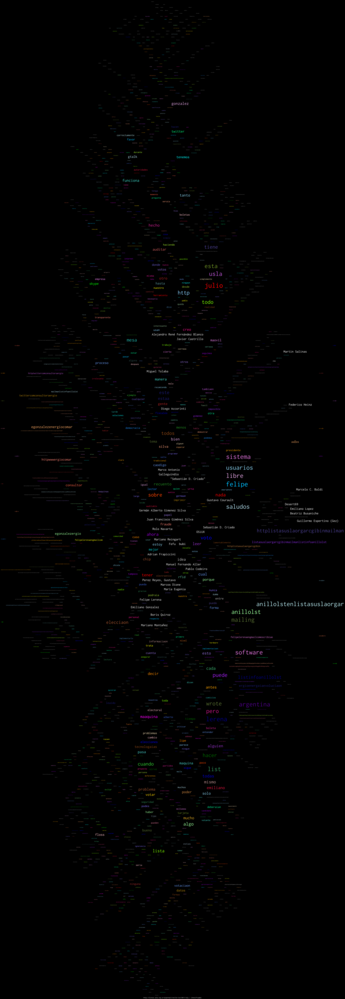

mails2dot
=========

Convert a mailman thread into beautiful graphic with graphviz.

execute
-------

::

    mails2dot.sh > code.dot
    fdp -Tpng code.dot > graphic.png

TODO
----

- add parameters for URL, REGEXP (actually harcoded)
- add stats like total words and emails
- test with other list/thread
- add background color option (test switch white/black)
- add CreativeCommons logo
- better capture of body email without signs
- bugfix

Big Example
-----------

- http://pub.osiux.com/mails2dot-high.png

Small Example
-------------

